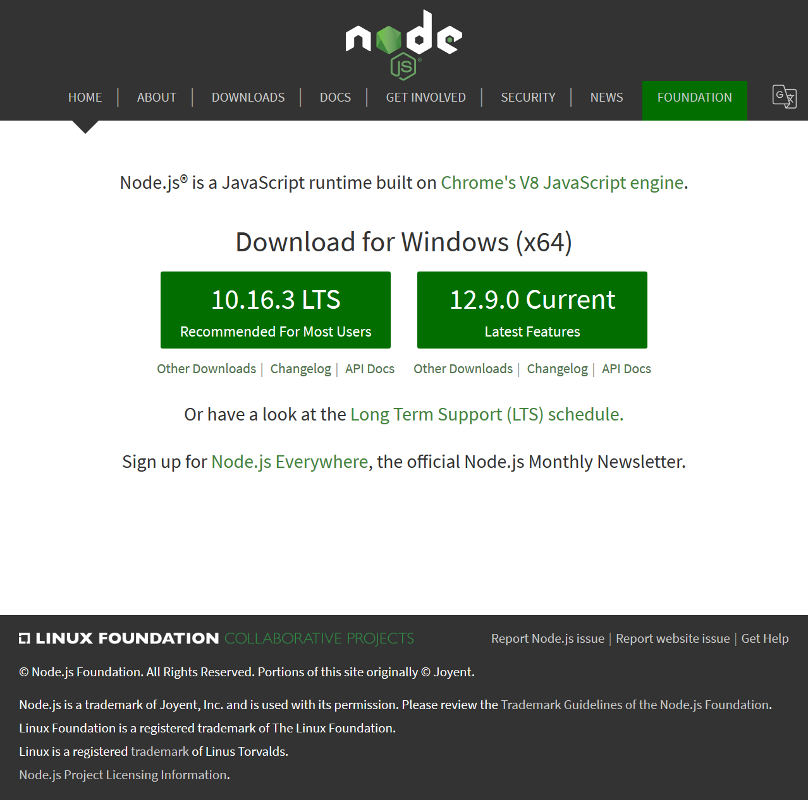
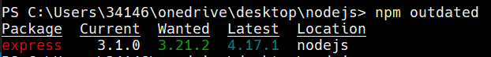
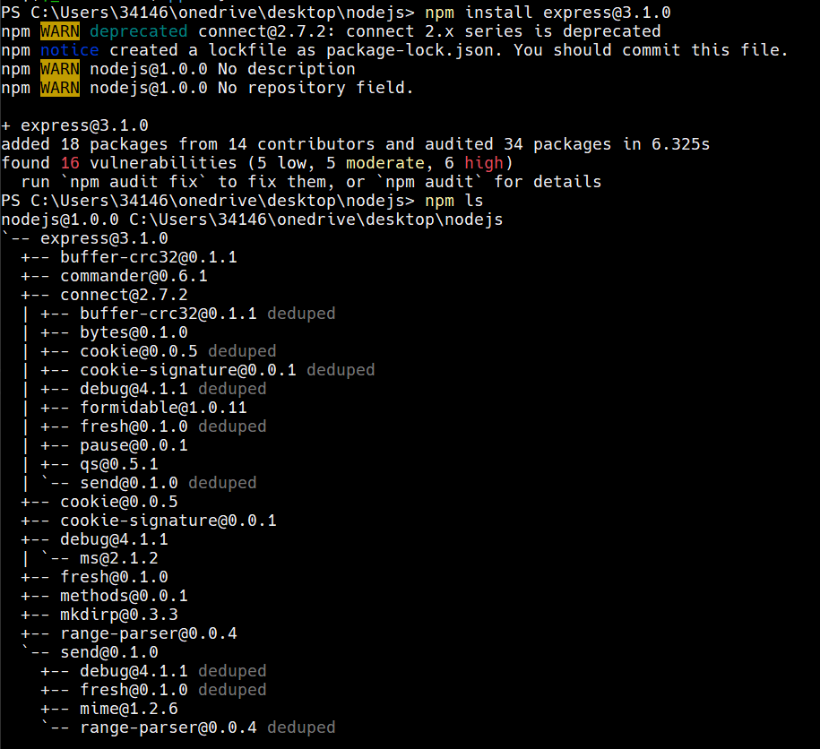
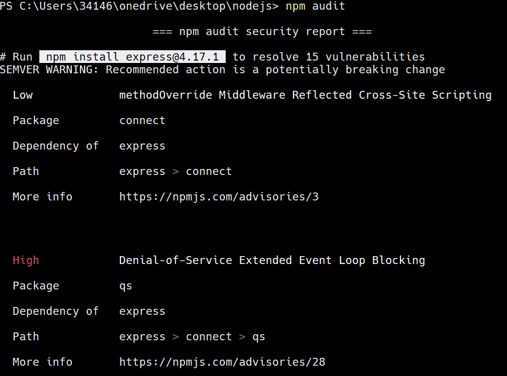

## Node.js 是什麼?

- 一套基於 Google Chrome 的 V8 引擎所做的 JavaScript 執行引擎
- 由非同步事件 (Asynchronous Events) 作為基底
- 具彈性且易部屬
- 相較於傳統網頁程式而言較輕巧
- 官網 nodejs.org



## 安裝

- Windows
  - 透過 nodist
    - 可隨時透過此工具更改 Node.js 版本
    - https://github.com/marcelklehr/nodist
  - 透過 choco
    - `choco install nodejs`
    - https://chocolatey.org
- Linux
  - 透過 `apt`/`pacman`
    - `apt install nodejs`
    - `pacman -S nodejs npm`
    - https://github.com/nodesource/distributions

# NPM 簡介及使用

## NPM 是什麼?

- NPM 為 Node.js 的預設套件管理系統
- NPM 可用於管理專案中所使用的各式 JavaScript 套件
  - e.g. `Express`, `lucas`, `dompurify`…etc.
- NPM 官方技術文件
  - https://docs.npmjs.com/

## package.json 是什麼?

- NPM 專案主核心之一
- 包含專案的詳細資訊如程式作者、所需套件等等的清單
  - 類似於 .NET 程式的 `*.csproj`
- 範例如下
```json
{
  "name": "my-package-name",
  "version": "1.0.0",
  "description": "",
  "main": "index.js",
  "author": "MyName"
}
```

# NPM 重點命令集

## NPM 重點命令集 #1

- `npm init <initializers>`
  - 設定 package.json
  - 初期專案設定

- `npm outdated`
  - 檢查 package.json 中所提及之套件更新



## NPM 重點命令集 #2

- `npm install <package>`
  - 安裝 Node.js 套件
  - 可用於更新 NPM 本身
    - `npm install -g npm`
  - 可直接安裝 GitHub 上套件
    - `npm install git://github.com/user/package.git#v1.1.0`



# NPM 風險偵測

## 如何進行初步偵測

- `npm audit`
  - 於2018晚期新增
  - 告知哪些元件具有已知風險
  - 可透過 `npm audit fix` 自動更新任何具風險之元件
 


## Severity (風險等級)

| 風險等級        | 建議行動           |
| --------------- | ------------------ |
| Critical (極高) | 須立即處理         |
| High (高)       | 須盡快處理         |
| Moderate (中)   | 時間准許情況下處理 |
| Low (低)        | 由擁有者自行決定   |

## 範例

```sh
  High            Denial-of-Service Extended Event Loop Blocking

  Package         qs

  Dependency of   express

  Path            express > connect > qs

  More info       https://npmjs.com/advisories/28
```