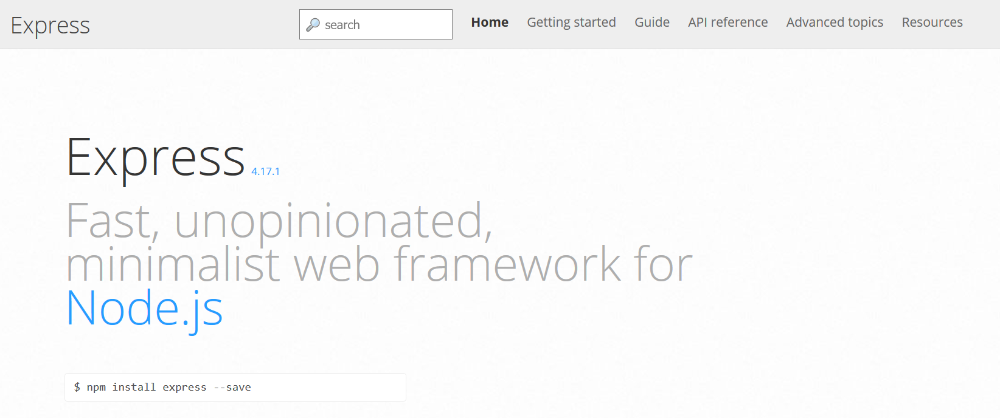
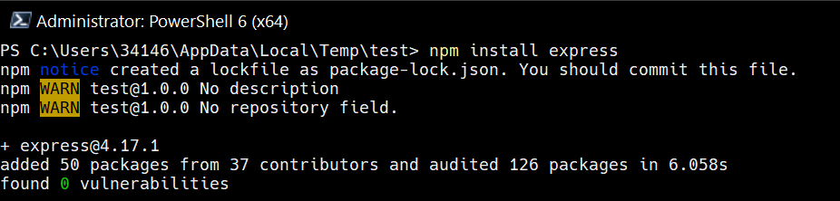
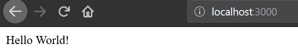

# 專案設定及介紹

## Express 是什麼?

- Express 是套快速及精簡的網頁框架
- 可用於快速設計 RESTful API



## Git 注意事項

- 若有使用 Git...
  * 在安裝 NPM 模組時會產生 `node_modules` 資料夾，此資料夾不需加入至 Git 內
  * `package-lock.json` 及 `package.json` 需要加入至 Git 內

](img/ch2-gitignore-example.png)

## 設定專案

1. 建立資料夾並在資料夾內開啟終端機
2. 輸入 `npm init`
   * 將設定此專案的 `package.json`
   * 預設輸出檔名為 `index.js`; 建議改為 `app.js`
3. 輸入專案相關資料如專案名稱、版本、作者...等
4. 輸入 `npm install express`
   * 將安裝最新版本的 `Express`



## Hello World 程式碼

```js
// 尋找名為 "express" 的 Node.js 套件並將其初始化
const express = require('express');
// 創建 express
const app = express();
// 設定 express 在哪一埠聽取 HTTP 請求
const port = 3000;

// 格式：app.get(path, callback [, callback ...])
//      使用指定的 callback 將 HTTP GET 請求調至指定的路徑
//      req 代表收到的 HTTP 請求
//      res 代表要送出去的 HTTP 回應
app.get('/', (req, res) => res.send('Hello World!'));

// 格式：app.listen([port[, host[, backlog]]][, callback])
//      綁定並監測指定埠口上的連接
app.listen(port, () => console.log(`Example app listening on port ${port}!`));
```

## 結果

1. 於同終端機內執行 `node app.js`
2. 若在瀏覽器中開啟 `http://localhost:3000` 見到 `Hello World` 的字串即代表運行成功



# 基礎路由 (Routing)

## 路由介紹

- 路由 (Routing) 指的是應用程式如何定義應用程式端點 (URI) 以及該如何回應客戶端請求的設定。
- 每一個路由可以有一或多個處理程式函數。
  - 當路由相符時，就會執行這些函數。
- 路由定義的結構如下：

```js
app.METHOD(PATH, HANDLER)
```

## 路由範例

- 於主頁中回應 `Hello World!`
```js
app.get('/', function (req, res) {
  res.send('Hello World!')
})
```

- 對 `/user` 路由發出 PUT 時的回應
```js
app.put('/user', function (req, res) {
  res.send('Got a PUT request at /user!')
})
```

# 發送靜態檔案

## `express.static` 使用

- Express 中有提供 `express.static` 當作發送靜態檔案的中介軟體。
- `express.static` 方法簽章如下
```js
express.static(root, [options])
```
- 其中， `root` 指的是該從哪個路徑指派這些靜態檔案

## 搭配 `app.use`

- 舉例來說 `app.use(express.static('public')` 將會從 `/public/` 資料夾中發布至該伺服器的主頁中
- `/public/hello-world.html` 檔案可於 `localhost/hello-world.html` 中見到
- 在使用 `app.use` 設計路由時也可以指定該於哪些路徑中指派這些檔案
  - e.g. 
  ```js
  app.use('/static', express.static('public'))
  ```