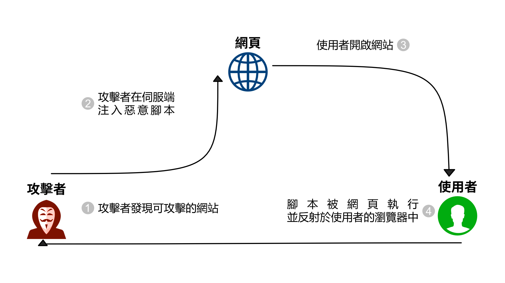
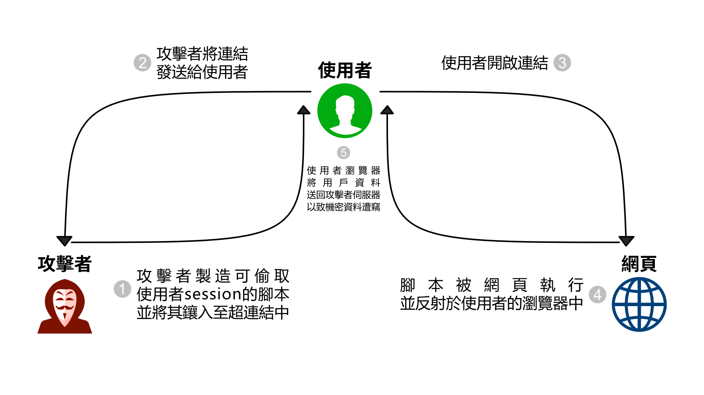

# XSS 簡介

## 什麼是跨網站指令碼 (XSS) 攻擊

- 依 OWASP 描述，Cross-Site Scripting (XSS) 攻擊指的是透過網頁設計漏洞注入惡意腳本至良性或可信賴的網站中。
- XSS 攻擊通常都是攻擊者透過具有漏洞的網頁程式來轉發惡意程式碼。
  - 這些攻擊之所以能成功大多是因為開發者疏忽，任意聽信於使用者所提供的字串。
- XSS 攻擊為 OWASP 2017 年報導中第七常見的網頁漏洞攻擊。
- 分為以下
  - Stored XSS
  - Reflected XSS
  - DOM-based XSS

## XSS 種類 - Stored XSS

- Stored XSS
  - 存儲式 XSS
  - XSS 腳本儲存在對方伺服器
  - 造成每次造訪都可能觸發此惡意腳本



## XSS 種類 - Reflected XSS

- Reflected XSS
  - 反射式 XSS
  - XSS 腳本為單次觸發
  - 常見為透過 query string 進行攻擊
    - e.g. `https://victim.corp/search?q=<script>alert('hi!')</script>`



# Node.js XSS 防禦措施前言

## 注意事項

- 每道所新增的防禦措施都可能會有缺點
  - 因此在防禦時，每道防線都要確實做好
- 千萬不能相信使用者所提供的任何東西
  - 不論使用者是有意還是無意的，只要前後端有處理使用者可提供的物件都有可能會有缺失

## Helmet

- Helmet 是一套專門與 Express 搭配的 Node.js 套件
- Helmet 將自動套用某些防止第三方攻擊的 HTTP Header
- 安裝
  - `npm install helmet --save`

## Helmet 使用

```js
let express = require('express');
let helmet = require('helmet');

let app = express();

// 選項一：
//      使用 Helmet 所提供的預設值
//      預設值詳情請見 https://helmetjs.github.io/
app.use(helmet());

// 選項二：
//      自行選擇使用 Helmet 所提供的防禦措施
app.use(helmet.xssFilter());
```

# Node.js XSS 防禦措施

## 清理/跳離使用者所提供的字串

- DOMPurify
- HTML 跳離

## DOMPurify

- 清理 HTML 字串
  - 降低 XSS 可能性
- FastMail 贊助開發
  - 有持續進行的 Bug Bounty 計畫
  - 找到漏洞並修補的頻率較高

---

- DOMPurify範例

```js
const createDOMPurify = require('dompurify');
const { JSDOM } = require('jsdom');

const window = (new JSDOM('')).window;
const DOMPurify = createDOMPurify(window);

// dirty 為不可信任的字串
// clean 為清理過後的字串
const clean = DOMPurify.sanitize(dirty);
```

## HTML 跳離

- 可透過 JavaScript 的 `replace` 將敏感字元跳脫為無害的字元
- e.g.
```js
let escapedInput = sanitizedInput.
    replace(/&/g, '&amp;').
    replace(/</g, '&lt;').
    replace(/"/g, '&quot;').
    replace(/'/g, '&#039;');
```

## Content Security Policy (CSP)

- CSP 是近年來 HTTP Header 中新增的一個 Response Header
  - `Content-Security-Policy`
- 提供一系列可指定來源的物件種類
- 可助於瀏覽器了解哪些是可信任且執行的腳本
  - 透過這點，即可以降低 XSS 成功的風險性
- CSP 並不是萬能法寶! 只是其中一道防線!

## 可透過 CSP 控制來源的物件種類

- 詳細列表請見 https://content-security-policy.com/

| 種類     | 名稱          |
| -------- | ------------- |
| 腳本     | `script-src`  |
| 圖片     | `img-src`     |
| 樣式表   | `style-src`   |
| 字型     | `font-src`    |
| 連結     | `connect-src` |
| 多媒體   | `media-src`   |
| 表單動作 | `form-action` |

## 透過 Helmet 設定 CSP

```js
app.use(helmet.contentSecurityPolicy({
    directives:{
        // 相等於 Content-Security-Policy: script-src 'self' code.jquery.com;
        scriptSrc: ["'self'", "code.jquery.com"]
    }
}));
```